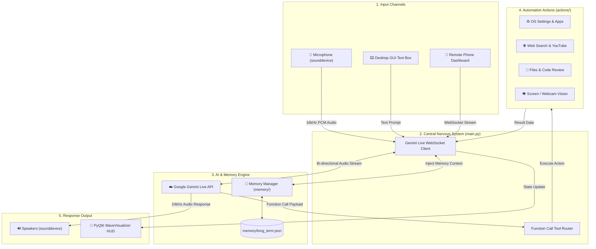

# 📐 PRUTHVI'S TARS — System Blueprint & Technical Architecture Guide

> **A Comprehensive Technical Specification & Blueprint**  
> Explaining the complete tech stack, repository requirements, system architecture, data flow, and directory breakdown for **PRUTHVI'S TARS**.

---

## 📦 1. Repository Requirements

### ❓ How many repositories are required to run this project?
* **Answer**: **Exactly ONE (1) Repository**.
* **Repository Name**: `PRUTHVIS TARS`
* **Description**: The entire application — including real-time voice streaming, AI function calling, desktop HUD GUI, OS automation tools, long-term persistent memory, and the remote phone dashboard — is **100% self-contained in this single repository**.
* **No external server repos, database clusters, or microservice dependencies required.**

---

## 🛠️ 2. Complete Technology Stack & Libraries

| Domain / Layer | Technologies & Packages Used | Purpose |
| :--- | :--- | :--- |
| **Language & Runtime** | Python 3.11 / 3.12 | Primary execution runtime. |
| **AI / LLM Intelligence** | `google-genai` SDK (v1alpha) | Interfaces with Google's **Gemini Live Multimodal API** (`gemini-2.5-flash-native-audio-preview-12-2025` & `gemini-2.0-flash`) via bi-directional WebSockets. |
| **GUI Framework** | `PyQt6` | Renders the sleek Iron-Man style desktop HUD window, state visualizers (`WaveVisualizer`), logs, and theme widgets. |
| **Real-Time Audio Stream** | `sounddevice`, `numpy`, `miniaudio` | Captures microphone input (16 kHz 16-bit PCM) and streams audio output (24 kHz PCM) with zero latency. |
| **Speech-to-Text (STT)** | `faster-whisper`, `vosk` | Offline neural speech recognition using CTranslate2 VAD buffering for local audio transcription. |
| **Text-to-Speech (TTS)** | `edge-tts`, `pyttsx3`, `kokoro` | High-definition cloud voice synthesis (`edge-tts`) with offline fallbacks (`pyttsx3`). |
| **Desktop Automation** | `pyautogui`, `pywin32`, `comtypes`, `pycaw` | Simulates mouse clicks, keypresses, app launching, window focus, system volume slider, and screen brightness. |
| **System Telemetry** | `psutil` | Real-time monitoring of CPU load, RAM usage, disk space, and temperatures. |
| **Web & Search** | `duckduckgo-search` (`ddgs`), `requests`, `beautifulsoup4` | Multi-mode live web searching, news aggregation, weather (`wttr.in`), and YouTube video queries. |
| **Remote Dashboard** | `FastAPI` / `Flask`, `WebSockets`, `qrcode` | Generates a mobile QR code and local web server on port 5000 to control TARS remotely from your phone. |
| **Memory Storage** | Native Python `json` | Lightweight, zero-dependency persistent storage (`memory/long_term.json`) with auto-trimming. |

---

## 🏛️ 3. Complete End-to-End System Blueprint & Data Flow



---

## 🔄 4. How It Works (Step-By-Step Operational Logic)

### Step 1: Boot & Initialization (`main.py`)
1. **Config Check**: Loads API keys and preferences from `config/api_keys.json`.
2. **GUI Launch**: Initializes the `PyQt6` HUD application window (`ui.py`).
3. **Memory Injection**: `memory/memory_manager.py` reads `memory/long_term.json`, formats your stored facts (name, project history), and appends them to Gemini's system prompt.
4. **WebSocket Connect**: Connects to Google's Gemini Live WebSocket endpoint (`models/gemini-2.5-flash-native-audio-preview-12-2025`).

### Step 2: Continuous Voice & Input Listening
1. `sounddevice.InputStream` continuously captures audio from your microphone at 16,000 Hz.
2. Raw PCM audio chunks are streamed in real time over the WebSocket to Gemini.

### Step 3: AI Reasoning & Tool Calling
1. Gemini processes the voice stream in real-time.
2. If you ask a question (e.g., *"What's the weather in Mumbai?"* or *"Play piano music on YouTube"*), Gemini emits a **Function Call (Tool Call)** payload.
3. `main.py` receives the function call, matches the tool name, and dispatches the execution to the corresponding module inside `actions/` (e.g., `actions/weather_report.py` or `actions/youtube_video.py`).

### Step 4: Action Execution & Audio Response
1. The action script executes (e.g., opening YouTube or fetching weather data via API).
2. The result is returned to Gemini or spoken back through the speakers using `sounddevice` and `edge-tts`.
3. The PyQt6 `WaveVisualizer` animates based on state (`LISTENING` = Green, `THINKING` = Yellow, `SPEAKING` = Blue).

### Step 5: Session Summary & Memory Persistence
1. At the end of the session, TARS generates a 1-2 sentence summary of what you discussed.
2. The summary is written to `memory/long_term.json`.
3. The next morning on boot, TARS reads yesterday's summary during your morning greeting and then recycles it so memory never bloats!

---

## 📂 5. Directory & File Reference

```
PRUTHVIS TARS/
├── main.py                     # 🧠 Central Nervous System & Live Gemini Router (77 KB)
├── ui.py                       # 🎨 PyQt6 Desktop HUD Window & Visualizer (137 KB)
├── PROJECT_STRUCTURE_GUIDE.md  # 📐 Complete System Blueprint & Tech Spec Guide
├── readme.md                   # 📄 Main Project README
├── requirements.txt            # 📦 Python Dependencies Manifest
├── setup.py                    # ⚙️ Installation & Packaging Script
│
├── actions/                    # 🦾 Action Modules & Function Tools (21 Files)
│   ├── open_app.py             # 🚀 App launcher (Spotify, Chrome, VS Code, etc.)
│   ├── computer_settings.py    # ⚙️ OS volume, brightness, power states
│   ├── computer_control.py     # 🖱️ Mouse clicks, hotkeys & PyAutoGUI controls
│   ├── desktop.py              # 🖥️ Window management (minimize, switch app)
│   ├── web_search.py           # 🔍 Multi-mode DuckDuckGo & Gemini search
│   ├── youtube_video.py        # 🎬 YouTube video search & playback controller
│   ├── weather_report.py       # 🌤️ Live weather reports (wttr.in)
│   ├── flight_finder.py        # ✈️ Flight price & schedule search
│   ├── send_message.py        # 💬 Message dispatching (WhatsApp, Telegram)
│   ├── screen_processor.py    # 👁️ Real-time screen & webcam vision capture
│   ├── file_controller.py      # 📁 Local file search & directory navigation
│   ├── file_processor.py       # 📄 Reading & summarizing documents/PDFs
│   ├── code_helper.py          # 💻 Inline code review & syntax checking
│   ├── dev_agent.py            # 🧑‍💻 Autonomous developer assistant
│   ├── system_monitor.py       # 📊 Hardware telemetry (CPU, RAM, GPU, temp)
│   ├── reminder.py             # ⏰ Scheduled OS notifications
│   ├── proactive.py            # 🔔 Time-aware proactive context check-ins
│   ├── background_monitor.py   # 👁️‍🗨️ Daily background news topic watcher
│   ├── game_updater.py        # 🎮 Steam & Epic Games update checker
│   └── google_workspace.py     # ☁️ Google Drive file & document search
│
├── core/                       # 🧠 Core Speech & AI Engines
│   ├── stt.py                  # 👂 Speech-to-Text engine (faster-whisper & Vosk)
│   ├── tts.py                  # 🗣️ Text-to-Speech engine (EdgeTTS & Kokoro)
│   ├── llm_client.py           # 💬 Local LLM client (Ollama & LM Studio)
│   ├── installer.py            # 📦 Model downloader & dependency installer
│   └── prompt.txt              # 📜 System Prompt & Persona definition
│
├── config/                     # ⚙️ Configuration & Credentials
│   ├── api_keys.json           # 🔑 Stored API Keys & User Preferences
│   ├── jarvis.ico              # 🎨 Desktop Application Icon
│   └── certs/                  # 🔒 Security Certificates
│
├── memory/                     # 📓 Persistent Memory Engine
│   ├── memory_manager.py       # 🧠 Long-term fact storage & context injection
│   ├── config_manager.py       # ⚙️ User preference persistence
│   └── long_term.json          # 💾 Stored memory JSON file
│
└── dashboard/                  # 📱 Remote Phone Web Dashboard
    ├── server.py               # 🌐 Flask & WebSocket server (Port 5000)
    └── static/                 # 📄 Web UI assets (HTML, CSS, JS, QR code)
```
